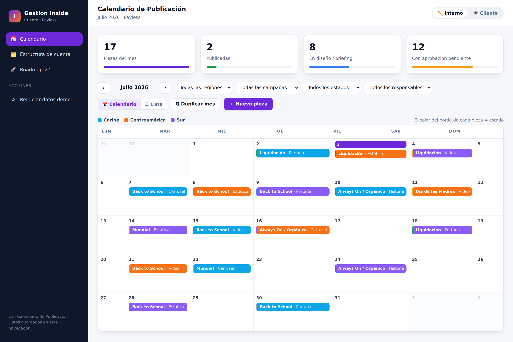

# Gestión Inside

Panel de operación de cuenta para agencia de marketing. Nace de la operación real de la cuenta **Payless** en Inside.

> **v1 — Calendario de Publicación.** App independiente, sin backend: se abre en el navegador y guarda todo localmente. Pensada para que la Gestión de Cuenta y las automatizaciones se conecten encima en la v2, sobre el mismo modelo de datos.



---

## Qué resuelve (los dolores de la reunión)

| Dolor detectado | Cómo lo ataca la herramienta |
|---|---|
| Status manual y desactualizado | Pipeline de estado visible por pieza (Briefing → Diseño → Revisión → Aprobación → Programado → Publicado). |
| "¿Este contenido aplica a mi país?" | Aprobación **por país** dentro de cada pieza, según su región. |
| Copiar-y-pegar Julio → Agosto | Botón **Duplicar mes**: clona las piezas al mes siguiente y resetea estados y aprobaciones. |
| Sin visibilidad para el cliente | Modo **Cliente** de solo lectura: ve estado y aprobaciones, no edita. |
| Estructura de cuenta caótica | Territorios, campañas y equipo centralizados en *Estructura de cuenta*. |

## Cómo usarla

Abrir `index.html` en el navegador (o servirla como sitio estático). No requiere instalación ni build.

- **Interno / Cliente** (arriba a la derecha): cambia entre editar y solo-ver.
- **Calendario / Lista**: dos vistas de las mismas piezas.
- Clic en una pieza para editarla; clic en `＋` de un día o en *Nueva pieza* para crear.
- Los filtros (región, campaña, estado, responsable) afectan ambas vistas.
- *Reiniciar datos demo* vuelve a la semilla de Payless.

Los datos se guardan en `localStorage` de ese navegador. Es una fuente de verdad propia por diseño: no depende de Teams/SharePoint.

## Estructura del proyecto

```
index.html        Shell de la app
css/styles.css    Estilos
js/data.js        Modelo + semilla (estructura real de Payless)
js/app.js         Estado, router, vistas, persistencia
```

## Modelo de datos

Una **pieza** es la unidad del calendario:

```js
{ id, fecha, mes, marca, campana, campanaId, regionId,
  formato, estado, responsable, link, notas,
  aprobaciones: { "País": "pendiente" | "aprobado" | "rechazado" } }
```

Alrededor: `regiones` (con sus países), `campanas`, `formatos`, `estados` (pipeline) y `personas` (equipo Inside + contactos del cliente). Este mismo esquema es el que la Gestión de Cuenta reutiliza en v2.

## Roadmap v2 (Gestión de Cuenta)

Cada módulo está atado a un dolor concreto de la operación:

1. **Árbol de matrices** — los 5 grupos (Mall/ATL, Pauta + sus 4 submatrices, Orgánica, Campañas) × 3 regiones, con status por matriz.
2. **Control de entregables con links** — material recibido / pendiente / accesos. Trazabilidad completa.
3. **Actas de reunión automáticas** — desde la transcripción; los acuerdos actualizan el status.
4. **Aprobación del cliente por país** — el cliente aprueba directo, sin pelear con los chats.
5. **Correo de estatus autogenerado** — un clic arma el reporte de material recibido/pendiente.
