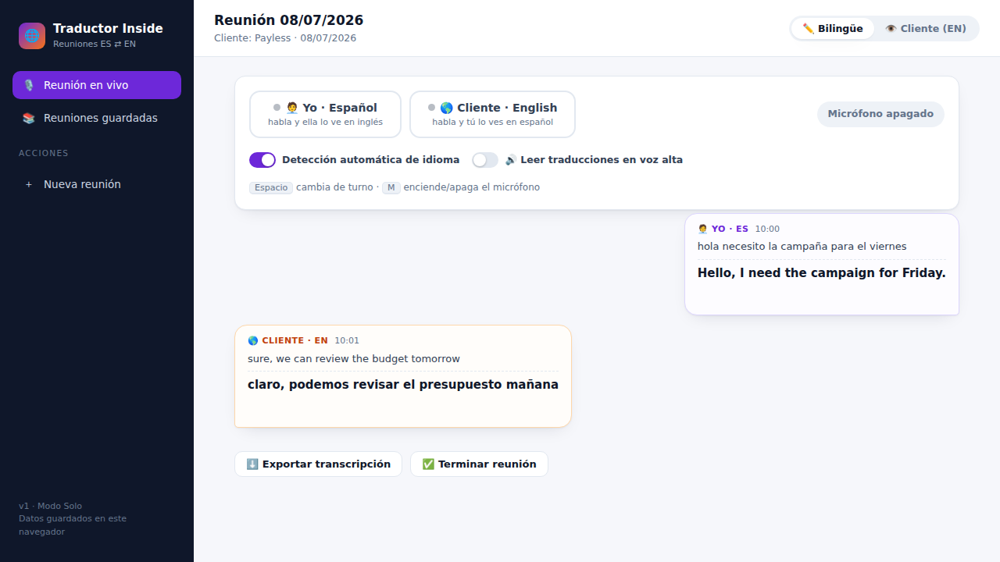

# Traductor Inside — Reuniones bilingües ES ⇄ EN

Traductor en vivo para reuniones con clientes que hablan inglés: mientras la clienta habla en inglés, tú ves el texto en español; cuando tú hablas en español, ella lo ve (y puede escucharlo) en inglés.



> **v1 — Modo Solo.** Toda la app corre en tu navegador, sin backend ni API keys: reconocimiento de voz, traducción y voz sintética son capacidades del propio navegador (con respaldos en línea para la traducción). La conversación no pasa por servidores propios.

## Cómo usarla

1. **Servir la app** (el micrófono requiere `localhost` o `https`, no funciona abriendo el archivo con doble clic):
   ```bash
   cd traductor
   python3 -m http.server 8080
   # abrir http://localhost:8080 en Chrome o Edge
   ```
2. **＋ Nueva reunión** → nombre del cliente y título.
3. Activa un micrófono:
   - **🧑‍💼 Yo · Español**: escucha en español y traduce al inglés.
   - **🌎 Cliente · English**: escucha en inglés y traduce al español.
4. Habla. Cada frase aparece como burbuja con su traducción debajo.

### Controles

| Control | Qué hace |
|---|---|
| **Detección automática de idioma** | Si una frase llega en el idioma contrario al esperado, la app la re-enruta y cambia el micrófono a ese idioma para las siguientes frases. |
| **🔊 Leer traducciones en voz alta** | Modo intérprete: cada traducción se lee con voz sintética apenas está lista (el micrófono se pausa mientras habla para no transcribirse a sí mismo). |
| **↔ Era EN / Era ES** (en cada burbuja) | Corrige una frase que la app clasificó en el idioma equivocado: la re-traduce en la dirección correcta. |
| **👁️ Cliente (EN)** (arriba a la derecha) | Vista con todo en inglés y letra grande — ideal para compartir la pestaña en Meet/Zoom. |
| `Espacio` | Cambia de turno (ES ⇄ EN) sin usar el mouse. |
| `M` | Enciende / apaga el micrófono. |

### Reuniones guardadas

Cada reunión queda guardada en el navegador (localStorage) con su transcripción bilingüe completa: se puede reabrir, continuar, **exportar como `.txt`** para minutas, o eliminar.

## Limitaciones honestas (v1)

- Funciona mejor en **Chrome o Edge** de escritorio; en Safari/Firefox el reconocimiento de voz es limitado o inexistente.
- El reconocimiento de voz gratuito comete errores con acentos cerrados, mala conexión o micrófonos pobres. La **detección automática** acierta la mayoría de las veces, pero en frases muy cortas puede fallar — para eso están los botones de turno y el botón **↔** de corrección.
- La traducción es buena para conversación de negocios; modismos muy locales pueden salir literales.
- La voz en alto suena unos segundos después de que la frase termina (no es doblaje simultáneo).

## Roadmap

- **Fase 2 — Sesión compartida por link**: la clienta abre un link en su navegador, ve la conversación en inglés en vivo y su voz se transcribe desde su propio dispositivo (sincronización WebRTC peer a peer, sin servidor). Requiere publicar la app en una URL `https` (p. ej. GitHub Pages).

## Estructura

```
traductor/
  index.html      Shell de la app
  css/styles.css  Estilos (misma familia visual que Gestión Inside)
  js/app.js       Reconocimiento de voz, detección de idioma, traducción,
                  voz sintética, reuniones y persistencia
```

## Modelo de datos

```js
// localStorage "ti_reuniones_v1"
{ id, titulo, cliente, fecha, creado,
  mensajes: [{ id, lang: "es"|"en", original, traduccion, error, hora }] }
```
